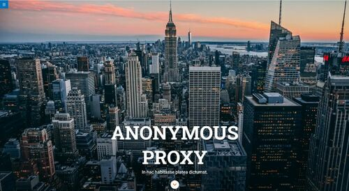

# **AnonymousProxyLandingPage**

Final Module 1 exercise of the Adalab Digital Frontend Development Bootcamp.

This is a responsive landing page developed with [](https://html.spec.whatwg.org/) [](https://www.w3.org/Style/CSS/) and [](https://sass-lang.com/)

## **Quick start guide**

Instructions to start this project:

### **Pre-requirements**

This project runs with Adalab Starter Kit [**here**](https://github.com/Adalab/adalab-web-starter-kit).

In order to use this kit it is needed to previously install [](https://nodejs.org/es/), [](https://git-scm.com/) and [](https://gulpjs.com/) to automate tasks and control project versions.

### **Installation**

1. Clone repository
2. Open a terminal
3. Run `npm install` on the terminal to install local dependencies

### **Run project**

Run `npm start` on the terminal.

This command has to be run everytime the project is started in order to:

1. Open the project on the browser using a local server.
2. Refresh browser everytime files contained in `/src` folder are updated.
3. Compiled files contained in `/src` folder and copy them in `/public` folder in order to be prepared for production environment.

### **Deployment**

1. Run these commands to update changes on the project:

```
git add -A
git commit -m "Message commit"
git push
```

2. Run `npm run docs` to create `/docs` folder and the production environment version.

3. Run again commands on step 1 to update changes on the project.

4. Project **[URL](https://anaguerraabaroa.github.io/AnonymousProxyLandingPage/)** is also available on GitHub Pages.

## **Exercise development requirements**

- Responsive web design for mobile, tablet and desktop devices
- Fixed header navigation menu. It is a fake link not a real menu
- Full screen hero image designed with flexbox
- Tips section designed with flexbox or CSS grid
- Articles section designed with CSS grid
- Footer designed with flexbox and fake navigation menu links
- Hero button linked to articles section
- Footer button linked to the top of the page
- Footer button with animation transition
- Section buttons with hover transition

## **Folder Structure**

```
AnonymousProxyLandingPage
├── docs
├── node_modules
├── public
├── src
│   ├── html
│   │   ├── partials
│   │   │   ├── footer.html
│   │   │   ├── header.html
│   │   │   ├── hero.html
│   │   │   ├── main-article.html
│   │   │   ├── main-reasons.html
│   │   │   ├── main-tips.html
│   │   │   └── main.html
│   │   └── index.html
│   ├── images
│   │    ├── cover.jpg
│   │    ├── ico-arrow.jpg
│   │    ├── ico-menu.svg
│   │    ├── ico-scroll-down.svg
│   │    ├── landing_desktop.jpg
│   │    ├── landing_mobile.jpg
│   │    └── landing_tablet.jpg
│   └── scss
│       ├── components
│       │   └── _typography.scss
│       ├── core
│       │   ├── _reset.scss
│       │   └── _variables.scss
│       ├── layout
│       │   ├── _footer.scss
│       │   ├── _header.scss
│       │   ├── _hero.scss
│       │   ├── _main-reasons.scss
│       │   └── _main-tips.scss
│       └── main.scss
├── .browserslistrc
├── .csscomb.json
├── .eslintrc.json
├── .gitignore
├── config.json
├── gulp-flow.png
├── gulpfile.js
├── LICENSE
├── package-lock.json
├── package.json
├── README.md
└── robots.txt
```

## **Result**

  
